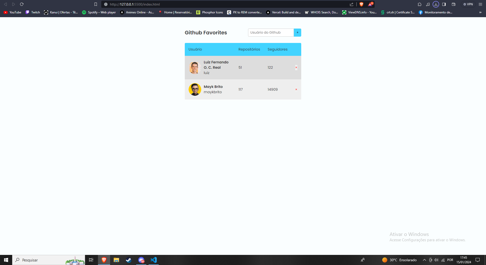

 

## 🚀 Tecnologias

Esse projeto foi desenvolvido com as seguintes tecnologias:

- HTML e CSS
- JavaScript
- API (endpoint do GitHub)
- Classes
- Async
- LocalStorage
- Git e Github

## 💻 Projeto

Acesso ao projeto: https://cloudsld.github.io/Git-Favorites/

O Github-Favorites é um aplicação com finalidade de treinar o conceito de API(endpoint), Async/await e LocalStorage.

